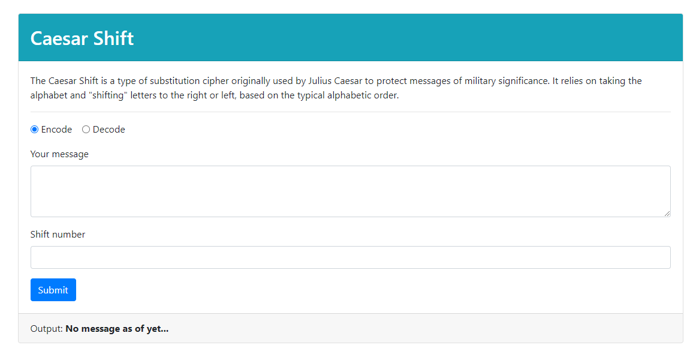

## Decoder Ring Project

Fun Thinkful project where I enabled functionality of three ciphers. 

Ciphers are a fun addition to interpersonal communication and these three would work great for any desired scenario.

The three ciphers included are a [Caesar cipher](https://en.wikipedia.org/wiki/Caesar_cipher),

a [Polybius Square cipher](https://en.wikipedia.org/wiki/Polybius_square), and a [Substitution cipher](https://en.wikipedia.org/wiki/Substitution_cipher).

The project site is live and can be found [here](https://developerkaleb.github.io/Decoder_Ring_Project/).

All of the coding I did in this project was done in vanilla Javascript.

In the future I may come back and add the ability to maintain case. Presently any inputted message will be changed to lowercase.
